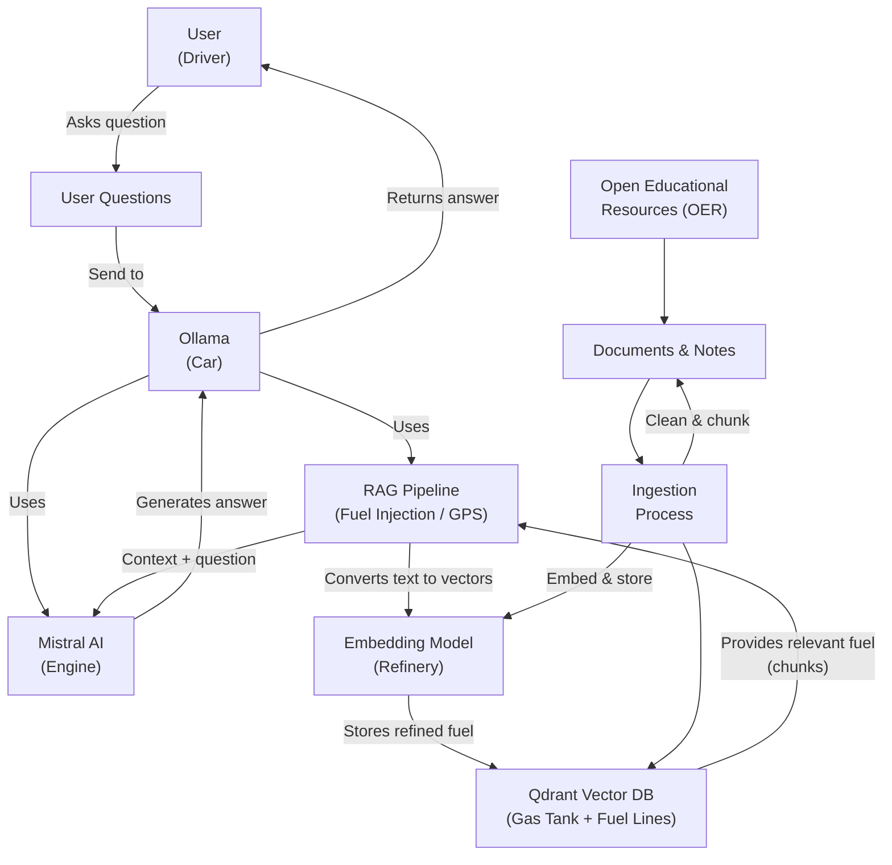

# Local LLM + RAG + Qdrant on a Mac (mini M4)

This is a textbook local RAG pipeline. Ollama runs the pre-trained Mistral model, Qdrant holds vectors for the PDFs, and the app glues them together so Mistral can answer questions grounded in those open-education documents.

How this setup maps to "proper" RAG:
- You ingest PDFs, chunk them, embed each chunk, and store those embeddings + text in Qdrant, this is the retrieval index.
- On a question, you embed the query, ask Qdrant for nearest chunks, then send **context chunks + user question** to Mistral via Ollama.
- Mistral itself stays frozen; it just "reads" the retrieved PDF snippets in the prompt and synthesizes an answer, which is exactly how RAG is described in Qdrant/Ollama examples.

You are giving your local engine a searchable memory (Qdrant) of those PDFs and letting it reason over that supplemental data at query time.

---



---

## 1. Prerequisites

1. Hardware  
  - Mac with 32 GB RAM

2. Software  
  - Homebrew installed
  - Python 3 installed
  - Rust (via `rustup`) for building Qdrant

---

## 2. Enable SSH (optional, for headless use)

In **Terminal**:

```bash
sudo systemsetup -setremotelogin on
sudo systemsetup -getremotelogin
# Should print: Remote Login: On
```

(If it complains about Full Disk Access, enable **Remote Login** once in System Settings > General > Sharing.)

---

## 3. Install Homebrew

If Homebrew is not installed:

```bash
/bin/bash -c "$(curl -fsSL https://raw.githubusercontent.com/Homebrew/install/HEAD/install.sh)"
echo 'eval "$(/opt/homebrew/bin/brew shellenv)"' >> ~/.zprofile
eval "$(/opt/homebrew/bin/brew shellenv)"
```

---

## 4. Install Ollama and models

Install Ollama:

```bash
brew install ollama
```

Start the Ollama server:

```bash
ollama serve
```

Pull models:

```bash
ollama pull mistral
ollama pull nomic-embed-text
```

---

## 5. Run Qdrant natively

Build and run Qdrant as a native binary.

### 5.1 Install Rust toolchain

If you have not already installed Rust via `rustup`:

```bash
curl --proto '=https' --tlsv1.2 -sSf https://sh.rustup.rs | sh
# Follow the prompts, then reload your shell:
source ~/.zshrc  # or ~/.bashrc depending on your shell
```

Ensure `cargo` is on your PATH:

```bash
echo 'export PATH="$HOME/.cargo/bin:$PATH"' >> ~/.zshrc
source ~/.zshrc

cargo --version
# should print something like: cargo 1.93.0 (...
```

### 5.2 Clone and build Qdrant

```bash
cd ~/projects
git clone https://github.com/qdrant/qdrant.git
cd qdrant

# Optional: install extra components
rustup component add rustfmt

# Build Qdrant in release mode
cargo build --release --bin qdrant
```

The compiled binary will be at:

```bash
~/projects/qdrant/target/release/qdrant
```

### 5.3 Run Qdrant as a local service

Start Qdrant directly:

```bash
cd ~/projects/qdrant
./target/release/qdrant
```

By default, Qdrant listens on port `6333`. The existing `.env` values will apply.

```env
QDRANT_HOST=127.0.0.1
QDRANT_PORT=6333
QDRANT_COLLECTION=docs
```

### 5.4 Optional: run Qdrant in the background

For a simple background process (manual start):

```bash
cd ~/projects/qdrant
nohup ./target/release/qdrant > qdrant.log 2>&1 &
```

To stop it, find the PID and kill:

```bash
ps aux | grep qdrant
kill <PID>
```

### 5.5 Verification
```bash
cd ~/projects/qdrant
./target/release/qdrant &
sleep 3
curl http://127.0.0.1:6333/healthz
```
---

## 6. Create virtual environment and install dependencies

```bash
mkdir -p ~/projects/local-rag-text
cd ~/projects/local-rag-text
python3.14 -m venv .venv
source .venv/bin/activate
python -m pip install --upgrade pip
python -m pip install beautifulsoup4 fastapi httpx jinja2 lxml ollama pypdf python-multipart qdrant-client  pydantic python-dotenv uvicorn

```

Create `.env`:

```bash
cat > .env << 'EOF'
OLLAMA_BASE_URL=http://127.0.0.1:11434
EMBED_MODEL=nomic-embed-text
CHAT_MODEL=mistral
QDRANT_HOST=127.0.0.1
QDRANT_PORT=6333
QDRANT_COLLECTION=docs
EOF
```

---

## 7. Core RAG script (`rag.py`)

Create `rag.py` in the project root:

```bash
cat > rag.py << 'EOF'
import os
from typing import List, Dict, Any

import httpx
from qdrant_client import QdrantClient
from qdrant_client.http.models import Distance, VectorParams, PointStruct
from dotenv import load_dotenv

load_dotenv()

...

if __name__ == "__main__":
    main()
EOF
```

Smoke test:

```bash
python rag.py --index
python rag.py --ask "Which machine is better for local LLM RAG workloads?"
```

---

## 8. Ingest Psychology 2e PDF (OER foundation)

1. Place `Psychology2e_WEB.pdf` into `pdf/`:

```bash
mv /path/to/Psychology2e_WEB.pdf pdf/Psychology2e_WEB.pdf
```

2. Create PDF ingester `ingest_pdf.sh`:

```bash
cat > ingest_pdf.sh << 'EOF'
import os
from typing import List, Dict

from pypdf import PdfReader
from rag import index_documents

...

if __name__ == "__main__":
    main()
EOF
```

3. Create `ingest_pdf.sh` shell file:

```bash
#!/usr/bin/env bash
set -euo pipefail

PROJECT_DIR="$(cd "$(dirname "${BASH_SOURCE[0]}")" && pwd)"
cd "$PROJECT_DIR"

...

echo "Ingesting $PDF_PATH with source prefix '$SOURCE_PREFIX'..."
python ingest_pdf.py --pdf "$PDF_PATH" --source-prefix "$SOURCE_PREFIX"
EOF
```

4. Make it executable:
```bash
chmod +x ingest_pdf.sh
```

Usage:

```bash
cd /path/to/my/projects/local-rag-text
./ingest_pdf.sh
# It will prompt: Enter PDF filename under pdf/:
# e.g.: Principles_of_Social_Psychology.pdf
```

This seeds your RAG with a full, intentional OER textbook, aligned with your goals and interests, not just random news.

---

## 9. Using the system

From the project root with venv active:

```bash
# General query
python rag.py --ask "How do power dynamics influence behavior in groups?"

# More specific
python rag.py --ask "Explain different bases of social power and how they affect relationships."
```

## 10. HTTP API server and macOS service

To use this RAG from other devices (Windows laptop, iPad, iPhone), expose it as a small HTTP API running on the macOS and keep it running in the background.

### 10.1 Create the API server (`api_server.py`)

Create `api_server.py` in the project root:

```bash
cat > api_server.py << 'EOF'
from fastapi import FastAPI, Request, Form
...
EOF
```

Test it manually:

```bash
source .venv/bin/activate
python -m uvicorn api_server:app --host 0.0.0.0 --port 8000
```

From another machine on your LAN (substitute your Mac's IP):

```bash
curl -X POST "http://MAC_OS_IP:8000/rag" \
  -H "Content-Type: application/json" \
  -d '{"question": "How does knowledge influence behavior in groups?"}'
```

You should receive a JSON response with `answer` and `contexts`.

### 10.2 Shell script to run the API server

Create `run_api_server.sh`:

```bash
cat > run_api_server.sh << 'EOF'
#!/usr/bin/env bash
set -euo pipefail
...
EOF
```

Make it executable:

```bash
chmod +x run_api_server.sh
```

You can now start the server manually with:

```bash
./run_api_server.sh
```

### 10.3 macOS launchd services (auto-start on login)

macOS uses `launchd` instead of systemd to run background services.

Create:
- `~/Library/LaunchAgents/com.localragtext.api.plist`
- `~/Library/LaunchAgents/com.localragtext.qdrant.plist`:

Load and start the agent:

```bash
launchctl load ~/Library/LaunchAgents/com.localragtext.api.plist
launchctl start com.localragtext.api

launchctl load ~/Library/LaunchAgents/com.localragtext.qdrant.plist
launchctl start com.localragtext.qdrant

```

To restart service:

```bash
launchctl unload ~/Library/LaunchAgents/com.localragtext.api.plist
launchctl load ~/Library/LaunchAgents/com.localragtext.api.plist

launchctl unload ~/Library/LaunchAgents/com.localragtext.qdrant.plist
launchctl load ~/Library/LaunchAgents/com.localragtext.qdrant.plist

```

Verify:

If the output displays the PID (Process ID) of the job, it is running.

```bash
launchctl list | grep com.localragtext.api
curl http://localhost:8000/chat

launchctl list | grep com.localragtext.qdrant
lsof -i :6333
```

---

The API server will now:

- Start automatically when you log into the Mac.
- Restart if it exits unexpectedly.
- Listen on `http://<Mac-Ip>:8000/rag` for POST requests from any device on your network.

This turns your purpose-built, goal-aligned RAG into a small, always-on service you can reach from other devices (Windows, iPad, or iPhone), not drifting into a generic, noisy, ever-changing news feed.

---

Online Public Resources (OER):

- https://openstax.org/
- https://open.umn.edu/
